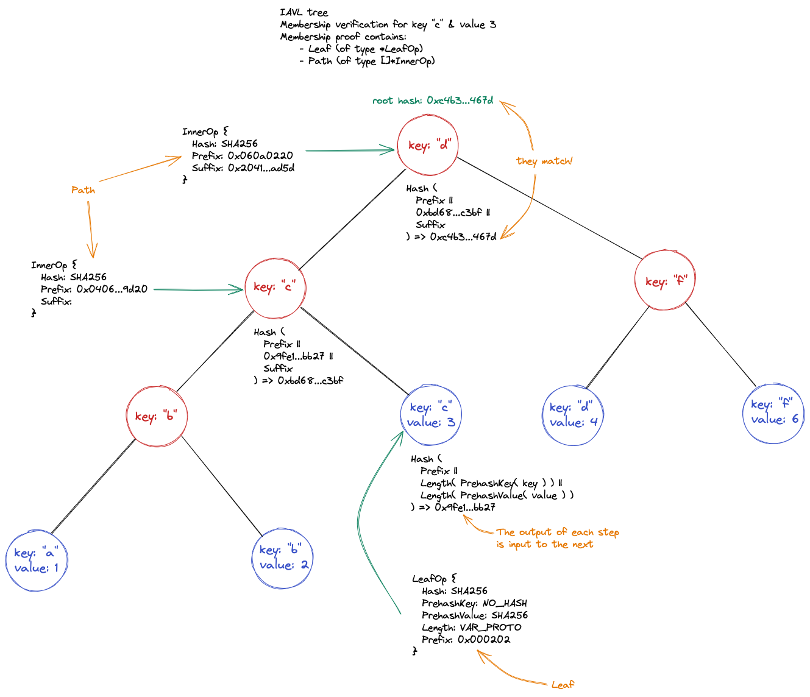
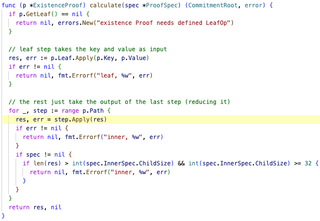

# ics23

As already stated in the README.md, ics23 attempts to be a generic library to represent and verify merkle proofs for (ideally) many different merkle tree storage implementations. The library is heavily used in [ibc-go](https://github.com/cosmos/ibc-go) for proof verification. The following documentation uses the Golang implementation as a reference.

The two most important top level types in the library are `ProofSpec` and `CommitmmentProof`. We will explain them in the coming sections.

## Proof specs

The [`ProofSpec`](https://github.com/cosmos/ics23/blob/go/v0.10.0/proto/cosmos/ics23/v1/proofs.proto#L145-L170) message defines what the expected parameters are for a given proof type. Different types of merkle trees will have different proof specs. For example, for [IAVL](https://github.com/cosmos/iavl) trees, [this](https://github.com/cosmos/ics23/blob/go/v0.10.0/go/proof.go#L9-L26) is the corresponding proof spec. The proof spec defines any contraints (e.g. minimum and maximum allowed depth of trees), what data should added (e.g. prefix or suffix data), what operations are executed on [leaf](https://github.com/cosmos/ics23/blob/go/v0.10.0/proto/cosmos/ics23/v1/proofs.proto#L96-L120) and [inner](https://github.com/cosmos/ics23/blob/go/v0.10.0/proto/cosmos/ics23/v1/proofs.proto#L172-L194) nodes of the tree when calculating the root hash, etc. 

```proto
message ProofSpec {
  LeafOp    leaf_spec  = 1;
  InnerSpec inner_spec = 2;
  int32     max_depth  = 3;
  int32     min_depth  = 4;
  bool prehash_key_before_comparison = 5;
}
```

where:

- `max_depth` is the maximum number of inner nodes in the tree.
- `min-depth` is the minimum number of inner nodes in the tree.
- `prehash_key_before_comparison` is a flag that indicates whether to use the `prehash_key` hash operation specified in the `leaf_spec`. This is used to compare lexical ordering of keys for non-existence proofs.

The `leaf_spec` is a [`LeafOp`](https://github.com/cosmos/ics23/blob/go/v0.10.0/proto/cosmos/ics23/v1/proofs.proto#L96-L120). The `LeafOp` type specifies the internal transformation from the original key/value pair of the leaf node into a hash. It specifies any prefix that should prepended and the hash operations to may transform the key and value, among other things:

```proto
message LeafOp {
  HashOp   hash          = 1;
  HashOp   prehash_key   = 2;
  HashOp   prehash_value = 3;
  LengthOp length        = 4;
  bytes    prefix = 5;
}
```

where:

- `hash` is [hash operation](https://github.com/cosmos/ics23/blob/go/v0.10.0/proto/cosmos/ics23/v1/proofs.proto#L7-L16) that is applied to the result of `(prefix || length(prehash_key(key)) || length(prehash_value(value))`, where the `||` operator is concatenation of binary data and `key` and `value` are the key and value of the leaf node. 
- `prehash_key` is the hash operation that is applied to the key of the leaf.
- `prehash_value` is the hash operation that is applied to the value of the leaf.
- `length` is the [length encoding operation](https://github.com/cosmos/ics23/blob/go/v0.10.0/proto/cosmos/ics23/v1/proofs.proto#L18-L43) that determines the length of the input and returns it prepended to the data.
- `prefix` is a fixed set of bytes that may optionally be prepended to differentiate a leaf node from an inner node.

And `inner_spec` is an [`InnerSpec`](https://github.com/cosmos/ics23/blob/go/v0.10.0/proto/cosmos/ics23/v1/proofs.proto#L172-L194). The `InnerSpec` specifies all store-specific structure information to determine if two proofs from a
given store are neighbors.

```proto
message InnerSpec {
  repeated int32 child_order       = 1;
  int32          child_size        = 2;
  int32          min_prefix_length = 3;
  int32          max_prefix_length = 4;
  bytes          empty_child       = 5;
  HashOp         hash              = 6;
}
```

where:

- `child_order` is the ordering of the children node and counts from 0. For example, for an IAVL tree is [0, 1] (left, then right); for a merk tree is [0, 2, 1] (left, right, here).
- `child_size`
- `min_prefix_length`
- `max_prefix_length`
- `empty_child` is the prehash image that is used when one child is `nil`.
- `hash` is the hashing algorithm that must be used in each element of an `InnerOp` list in an `ExistenceProof`.

## Proof types

The [`CommitmentProof`](https://github.com/cosmos/ics23/blob/go/v0.10.0/proto/cosmos/ics23/v1/proofs.proto#L84-L94) is either an `ExistenceProof` or a `NonExistenceProof`, or a batch of such messages: 

```proto
message CommitmentProof {
  oneof proof {
    ExistenceProof       exist      = 1;
    NonExistenceProof    nonexist   = 2;
    BatchProof           batch      = 3;
    CompressedBatchProof compressed = 4;
  }
}
```

At the moment the library has support for [`ExistenceProof`](https://github.com/cosmos/ics23/blob/go/v0.10.0/proto/cosmos/ics23/v1/proofs.proto#L45-L71) and [`NonExistenceProof`](https://github.com/cosmos/ics23/blob/go/v0.10.0/proto/cosmos/ics23/v1/proofs.proto#L73-L82).

The `ExistenceProof` 

```proto
message ExistenceProof {
  bytes            key   = 1;
  bytes            value = 2;
  LeafOp           leaf  = 3;
  repeated InnerOp path  = 4;
}
```

where:

- `key` is the key of the leaf node.
- `value` is the value of the leaf node. 
- `leaf` specifies the operations to perform on the leaf node to internally transform its data into a hash.
- `path` is a list of items of type `InnerOp` that specify the operations to iteratively perform on inner nodes of a tree to calculate a root hash. `InnerOp` represents a merkle-proof step that is not a leaf. It represents concatenating two children and hashing them to provide the next result:

```proto
message InnerOp {
  HashOp hash   = 1;
  bytes  prefix = 2;
  bytes  suffix = 3;
}
```

where:

- `hash` is the hash operation that is applied to the result of `(prefix || child || suffix)`, where the `||` operator is concatenation of binary data and where `child` the result of hashing all the tree below this step.
- `prefix` is is a fixed set of bytes that may optionally be prepended to differentiate from lead nodes.
- `suffix` is a fixed set of bytes that may optionally be appended  to differentiate from leaf nodes.

We will explain more details of the different supported proof types in the following sections, where we see an example of how each proof type is used.

## Membership verification

For membership verification of a key/value pair in a merkle tree we need an [`ExistenceProof`](https://github.com/cosmos/ics23/blob/go/v0.10.0/proto/cosmos/ics23/v1/proofs.proto#L45-L71). An `ExistenceProof` contains the key and value to prove existence of, and a set of steps to calculate a hash that can be compared with a merkle tree root hash. The `ExistenceProof` struct contains the method `Verify`: 

```go
func (p *ExistenceProof) Verify(
  spec *ProofSpec,
  root CommitmentRoot,
  key []byte,
  value []byte
) error
```

where `spec` is the corresponding `ProofSpec` for the concrete merkle tree, `root` is a byte slice that represents the merkle tree root hash (with which the calculated hash from the proof will be compared), and `key` and `value` are byte slices for the leaf node pair to be verified. We will see this method in action in the following sample program:

```go
package main

import (
  "fmt"

  log "cosmossdk.io/log"
  iavl "github.com/cosmos/iavl"
  dbm "github.com/cosmos/iavl/db"
  ics23 "github.com/cosmos/ics23/go"
)

func main() {
  key := []byte("c")
  value := []byte{3}

  tree := iavl.NewMutableTree(dbm.NewMemDB(), 0, false, log.NewNopLogger())

  _, err := tree.Set(key, value)
  if err != nil {
    fmt.Println(err)
  }

  tree.Set([]byte("f"), []byte{6})
  tree.Set([]byte("d"), []byte{4})
  tree.Set([]byte("c"), []byte{3})
  tree.Set([]byte("b"), []byte{2})
  tree.Set([]byte("a"), []byte{1})

  // retrieve root hash of merkle tree
  rootHash, version, err := tree.SaveVersion()
  if err != nil {
    fmt.Println(err)
    os.Exit(1)
  }

  fmt.Printf("saved version %v with root hash %x\n", version, rootHash)

  // retrieve membership proof for key "c"
  proof, err := tree.GetMembershipProof(key)
  if err != nil {
    fmt.Println(err)
    os.Exit(1)
  }

  // check membership of key/value "c"/3
  ok := ics23.VerifyMembership(ics23.IavlSpec, rootHash, proof, key, value)
  fmt.Println(ok)
}
```

This simple program creates an IAVL tree, adds a few key/value pairs, and verifies an existence proof. The following diagram represents the IAVL tree created with the sample code above and the steps that the ics23 library performs [during membership verification](https://github.com/cosmos/ics23/blob/go/v0.10.0/go/proof.go#L110) (the hexadecimal values in the picture are the actual values generated during the verification for this particular tree and proof):



If we run the program with the debugger and step through it, the entry point for ics23 is the [`VerifyMembership`](https://github.com/cosmos/ics23/blob/go/v0.10.0/go/ics23.go#L36) function:


Inside `VerifyMembership` the `proof`, which is of type `CommitmentProof`(https://github.com/cosmos/ics23/blob/go/v0.10.0/proto/cosmos/ics23/v1/proofs.proto#L84-L94) is converted to an `ExistenceProof` and then the function `Verify` is called:


The existence proof contains a `LeafOp` and a `Path`, which is a list of items of type `InnerOp` (there are as many items as inner nodes on the tree - i.e. excluding the leaf and the root nodes):


Inside `Verify` the existence proof is checked against the corresponging proof spec (i.e. an existence proof for an IAVL tree will be checked against the IAVL proof spec). [This means that the parameters of the leaf operation and the parameters of each inner operation in the path of the existence proof will be checked](https://github.com/cosmos/ics23/blob/go/v0.10.0/go/proof.go#L181-L206) against the specs for leaf and inner nodes:


If the check against the proof spec passes, then the leaf operation is applied:


And the result of that operation is fed into the firs inner operation. The result of each inner operation will be fed into the next one until we iterate over the complete list of inner operations:




The result from the last inner operation can be compared against the input root hash and if they match then the verification succeeds:


## Non-membership verification

TODO